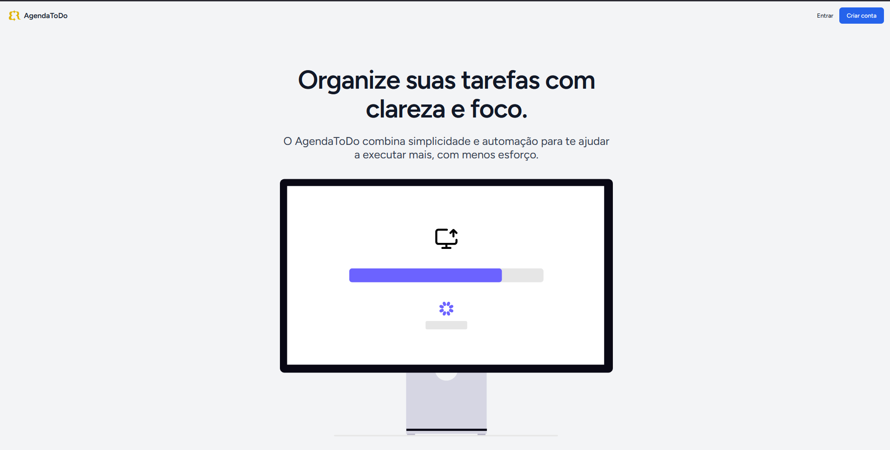
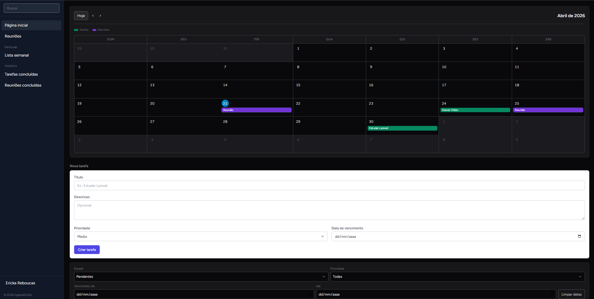
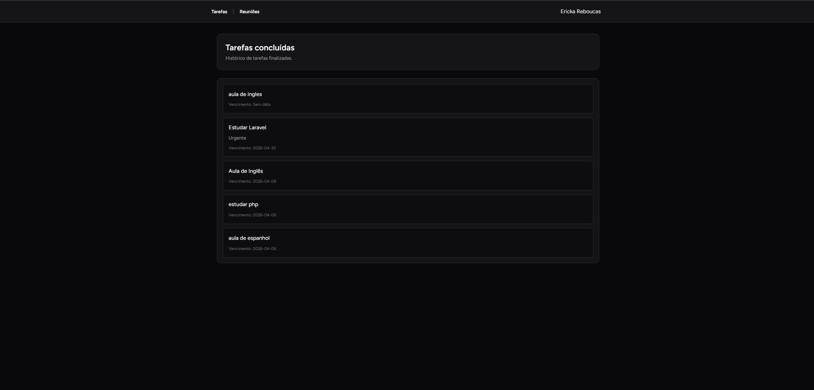
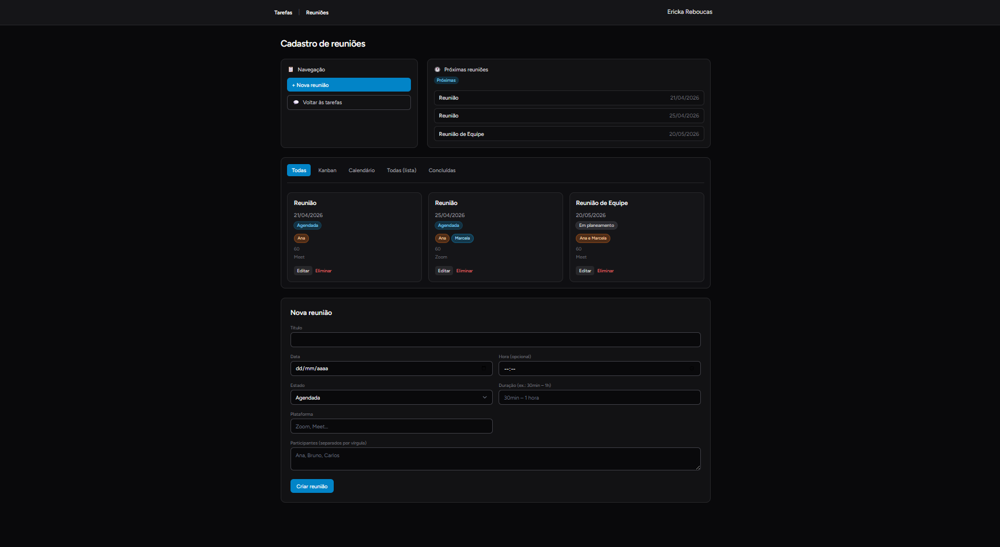

# AgendaToDo

Aplicação web de produtividade com **gestão de tarefas (To-Do)** e **gestão de reuniões**, autenticação (incluindo 2FA) e interface responsiva.

---

## Visão geral

Aplicação **Laravel** com frontend **Vue 3** e **Inertia.js**, estilizada com **Tailwind CSS**. Cada utilizador autenticado gere as suas tarefas e reuniões de forma isolada — nenhum utilizador acede a dados de outro.

A interface é servida pelo próprio Laravel via Inertia (sem API REST separada), e os componentes usam **Reka UI** + **Lucide** para ícones e primitivos acessíveis.

---

## Stack técnica

| Camada          | Tecnologia                                          |
| --------------- | --------------------------------------------------- |
| Backend         | Laravel 13, PHP 8.3+                                |
| Frontend        | Vue 3, Inertia.js 2, TypeScript                     |
| Bundler         | Vite 8                                              |
| UI / Estilos    | Tailwind CSS 3, Reka UI, Lucide, `tw-animate-css`   |
| Base de dados   | MySQL (configurável via `.env`)                     |
| Autenticação    | Laravel **Fortify** (+ scaffolding Breeze), com 2FA |
| Qualidade (PHP) | Laravel Pint                                        |
| Qualidade (JS)  | ESLint, Prettier, `vue-tsc`                         |
| Testes          | Pest (feature)                                      |

---

## Funcionalidades

### Tarefas

- Criar tarefa com **título** (obrigatório), **descrição** (opcional), **data de vencimento** e **prioridade** (`low` / `medium` / `high`).
- Editar qualquer um dos campos, **alternar estado** (pendente ↔ concluída) ou **eliminar**.
- Listagem com filtros combinados:
    - **Estado**: pendente, concluída ou todas.
    - **Prioridade**.
    - **Intervalo de datas** de vencimento (`due_from` / `due_to`).
    - **Pesquisa** livre em título e descrição.
    - **Vista semanal** (`view=week`): tarefas com vencimento na semana atual.
- Página dedicada `/tarefas/concluidas` com o histórico de concluídas.
- **Calendário integrado** que mostra tarefas e reuniões no mesmo layout (a página principal já recebe as reuniões relevantes para este efeito).

### Reuniões

- Criar, editar e eliminar reuniões com: **título**, **data**, **hora** (opcional), **estado** (`planning` / `scheduled` / `completed`), **duração**, **plataforma** e **lista de participantes** (introduzida como texto e armazenada como array).
- Vistas / separadores: **all**, **kanban**, **calendar**, **list**, **completed**.
- Bloco _upcoming_ (próximas 8 reuniões não concluídas) disponibilizado ao frontend.

### Autenticação e contas

- Registo, login, logout, recuperação e reposição de password.
- Verificação de email e confirmação de password.
- **Two-Factor Authentication (2FA)** via Fortify, com ativação por QR code (Google Authenticator), confirmação por código, _recovery codes_ e desativação (`TwoFactorChallenge.vue` + secção 2FA em `settings/Profile.vue`).
- Área de **definições** (`/settings`):
    - **Perfil** (`Profile.vue`): consulta de nome/email, alteração de palavra-passe e gestão completa de 2FA.
    - **Aparência** (`Appearance.vue`): placeholder preparado para integração futura de tema claro/escuro.

### Segurança

- Rotas da aplicação protegidas pelo middleware `auth`.
- Todos os recursos (tarefas e reuniões) estão associados a `user_id`; qualquer tentativa de atualização ou eliminação por outro utilizador devolve **HTTP 403**.

### Testes

- Cobertura de CRUD, filtros e isolamento entre utilizadores em:
    - `tests/Feature/TasksTest.php`
    - `tests/Feature/MeetingTest.php`
    - `tests/Feature/DashboardTest.php`

---

## 📸 Preview

### Layout



### Dashboard



### Tarefas



### Reuniões



## Estrutura relevante

| Caminho                                      | Descrição                                                         |
| -------------------------------------------- | ----------------------------------------------------------------- |
| `app/Models/TaskModel.php`                   | Modelo Eloquent das tarefas e regras de estado.                   |
| `app/Models/Meeting.php`                     | Modelo Eloquent das reuniões (estados, cast de participantes).    |
| `app/Http/Controllers/TaskController.php`    | Listagem, filtros, CRUD e toggle das tarefas.                     |
| `app/Http/Controllers/MeetingController.php` | CRUD das reuniões e separadores (`all/kanban/calendar/list/...`). |
| `routes/web.php`                             | Rotas da app (landing, `/app`, `/tarefas`, `/reunioes`, etc.).    |
| `routes/auth.php`                            | Rotas de autenticação (Breeze + Fortify).                         |
| `resources/js/pages/Welcome.vue`             | Landing pública.                                                  |
| `resources/js/pages/Tasks/TaskApp.vue`       | Página principal das tarefas (com calendário).                    |
| `resources/js/pages/Tasks/Completed.vue`     | Histórico de tarefas concluídas.                                  |
| `resources/js/pages/Meetings/Index.vue`      | Página principal das reuniões.                                    |
| `resources/js/pages/Auth/*`                  | Login, registo, reset, 2FA, verificação de email, etc.            |
| `resources/js/pages/settings/*`              | Perfil e aparência.                                               |
| `resources/js/features/Tasks/`               | Componentes de formulário, lista e calendário de tarefas.         |

---

## Requisitos

- PHP **8.3+**
- Composer
- Node.js e npm (para Vite / frontend)
- Servidor MySQL (ou outro driver suportado pelo Laravel, conforme `.env`)

---

## Como executar

### 1. Clonar e entrar na pasta

```bash
git clone <url-do-repositorio>
cd agendatodo
```

### 2. Dependências PHP e Node

```bash
composer install
npm install
```

### 3. Ambiente e chave da aplicação

```bash
cp .env.example .env
php artisan key:generate
```

Editar o ficheiro `.env` e configurar a ligação à base de dados (`DB_*`). Por defeito o `.env.example` usa MySQL (`DB_CONNECTION=mysql`, base `agendatodo`).

### 4. Migrações

```bash
php artisan migrate
```

### 5. Servidor de desenvolvimento

**Opção recomendada — tudo num comando** (usa `concurrently` para levantar `artisan serve`, `queue:listen` e `vite` em paralelo):

```bash
composer dev
```

**Opção manual — em dois terminais:**

```bash
php artisan serve
```

```bash
npm run dev
```

Abrir o URL indicado pelo Artisan (por exemplo `http://127.0.0.1:8000`).

---

## Qualidade e testes

### Testes

```bash
php artisan test
```

### Lint / formatação / tipos

```bash
# PHP
composer lint          # Pint (auto-fix)
composer lint:check    # Pint em modo check

# Frontend
npm run lint           # ESLint (auto-fix)
npm run lint:check     # ESLint em modo check
npm run format         # Prettier (auto-fix)
npm run format:check   # Prettier em modo check
npm run types:check    # vue-tsc (sem emit)
```

### Pipeline completo (como em CI)

```bash
composer ci:check
```

Executa `lint:check` + `format:check` + `types:check` + testes.

---

## Build para produção

```bash
npm run build
```

Para SSR:

```bash
npm run build:ssr
```

Garantir que o ambiente de produção aponta para os assets compilados e que `APP_ENV` / `APP_DEBUG` estão corretos.

---

## Notas

- A camada SPA usa **Inertia.js**: o Laravel devolve respostas que o Vue renderiza, sem API REST separada para estas páginas.
- Autenticação e fluxos de sessão são tratados por **Fortify** (com scaffolding inicial vindo do Breeze), incluindo 2FA.
- A página `/breve/{feature}` serve como _placeholder_ genérico (`ComingSoon.vue`) para secções ainda não implementadas, com ligações rápidas para Tarefas, lista semanal e Reuniões.
- `/dashboard` existe apenas por compatibilidade com o Breeze e redireciona para `/app`.

---

**Autor:** Ericka Rebouças — desenvolvido no âmbito do estágio na **Inovcorp**.
